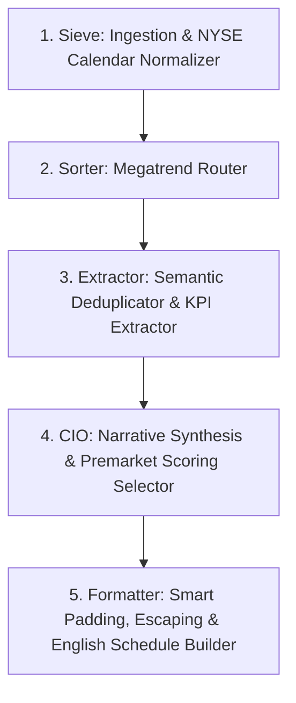

# Buddy Core Pipeline

Buddy Core is an automated, multi-agent Intelligence Pipeline designed to act as a personal multi-billionaire Chief Investment Officer (CIO). The system monitors global news via RSS/SEC Edgar/X, tracks market indicators, extracts deeply actionable facts using LLMs, and synthesizes them into highly curated, professionally structured daily reports in English.

---

## Project Architecture & Data Flow

The pipeline operates on a **Dual-Trigger System** (Full vs. Pre-market) utilizing **incremental processing** to optimize API costs, ensure data continuity, and prevent redundant LLM extraction.



### 1. Sieve (`sieve/`)

**Role:** Data Gathering, NYSE Calendar Ingestion & Rule-Based Filtering Bot

- **Continuous Multi-Source Fetching:** Deployed on an independent Oracle Cloud VM operating 24/7 (`sieve/sieve.py`). It dynamically polls over 40 distinct RSS and API streams, including SEC EDGAR (8-K, 10-K, 10-Q) per target ticker, Yahoo Finance, CNBC, TechCrunch AI, FierceBiotech, SpaceNews, CoinDesk, WSJ Markets, and curated financial experts on X (via Nitter RSS feeds).
- **NYSE Holiday & Observed Day Normalization:** Implements robust holiday tracking using `holidays.financial_holidays("NYSE")` to automatically determine active trading closures, converting observed holidays and observed weekend shifts into distinct representations (`sieve/daily_job.py`).
- **Investing.com & Finnhub Ingestion:** Merges high/medium importance economic calendar occurrences from Investing.com domain API endpoints and matches upcoming earnings calls from the Finnhub API for target tickers within a rolling 7-day window.
- **Semantic Deduplication & Cache Flushing:** Utilizes `difflib.SequenceMatcher` to perform real-time, in-memory duplicate checks (similarity threshold > 0.8) of article titles. Implements an in-memory cap limit (100 articles) and automatically flushes the cache to disk (`.daily_cache_temp.json`) to control RAM footprints on low-spec cloud instances.
- **Timezone-Aligned Daily Saves:** Operates strictly on `America/New_York` timezone, scheduling three different saving intervals (`sieve/daily_job.py`):
  - **00:00 & 03:00 EST:** Incremental Saves (saves fetched articles to daily rolling JSON files).
  - **06:00 EST:** Daily Master Save & Cache Reset (ingests weekly schedules, market maps, and resets seen URLs/cache for the next 24 hours).
  - **08:30 EST:** Premarket Save (combines the 06:00 AM dump with premarket arrivals for premarket context).

### 2. Sorter (`src/sorter.py`)

**Role:** Article Categorization & Keyword Scoring Router

- **Multi-Trend Classification:** Routes raw incoming news articles into distinct mega-trends driven by GICS sector classification and prompt-based target keywords.
- **Dynamic AGENT_CONFIGS Binding:** Seamlessly merges the prompt-defined categories and keyword lists from `src/prompts.py` with a built-in legacy routing map fallback (e.g. General, Bitcoin, Semiconductor, AI, Bio, Aerospace, Software, Others).
- **Frequency-Based Keyword Matcher:** Performs deep text keyword scanning on both the title and full-text content. Computes a cumulative score using word boundary regexes (`\bkeyword\b` for exact acronyms, case-insensitive) to assign each article to the highest-scoring category, falling back safely to `Others` if zero keywords match.
- **Category Export Isolation:** Exports categorized articles into individual `[category]_sorted_YYYYMMDD.json` files, skipping file generation entirely for empty categories to save disk writing overhead.

### 3. Extractor (`src/extractor.py`)

**Role:** AI Fact Extraction Engine & Semantic State Deduplicator

- **Sentence-Transformers Deduplication:** Loads a lightweight `all-MiniLM-L6-v2` embedding model to generate semantic fingerprints (Title + first 3 sentences) for sorted articles. Automatically drops articles with a cosine similarity >= `0.82` against previously processed items to filter downstream redundancy.
- **Incremental State Management:** Tracks handled items in `extracted_state_YYYYMMDD.json` to safely bypass already extracted news items across consecutive incremental runs, conserving local CPU/GPU cycles.
- **Rigid Text Pre-Cleaning:**
  - `strip_tables`: strips out markdown tables and plain-text financial sheets (e.g., Consolidated Balance Sheets, Income statements, reconciliations) from raw article bodies using header triggers and exit paragraph heuristic matches.
  - `strip_captions`: strips out image captions, charting/data platform references (e.g., Coinglass, TradingView), and raw metadata lines.
  - Emojis and target symbols are cleanly scrubbed from input strings to save LLM tokens.
- **SEC Filing LLM Bypass:** Bypasses LLM costs entirely for SEC filings (8-K, 10-K, 10-Q). Directly outputs a cleanly formatted hyperlink `[Ticker FormType](URL)` sorted alphabetically under the SEC section.
- **Direct Ollama Orchestration:** Drives a local Ollama LLM (`llama3.1`) directly via synchronous requests, bypassing heavy agentic framework (ReAct loops) overhead to maximize extraction speed. Enforces strict zero-temperature presets (`temperature=0.0`, `top_p=0.1`, `num_ctx=8192`).
- **Noise Filter Heuristics:** Automatically filters out:
  - Garbage LLM outputs (e.g. starting with `NO_EXTRACTION` or `NO DATA`).
  - Items with a high digit-to-letter ratio (numerical dumps).
  - Contextless financial statistics without sentences (falls back to Title-only hyperlink if the output is too short or lacks structural punctuation).

### 4. CIO (`src/cio.py`)

**Role:** Narrative Commentary Synthesis & Premarket 3D Selector

- **Billionaire Mentor Daily Point:** Weaves global market heatmaps, upcoming 7-day schedule, and LLM-extracted facts into a cohesive daily brief written in professional, elegant English.
  - **Topline Signals (Part 1):** Exact cold, terminal-style bullet list of the top 3 most critical KPIs containing hard metrics only (e.g. "$180B CapEx", "28% YoY").
  - **Daily Point (Part 2):** Insightful, polite narrative that dismisses short-term noise, connecting events to structural trends. Enforces the "Sandwich method" constraint (begins exactly with "Good day." and no headers/bullets, formatted in continuous text paragraphs).
- **Premarket 3D Scoring System:** Evaluates and selects the absolute most critical premarket news items by scoring them across 3 dimensions:
  1. _Macro & Market Impact_ (1-5 pts)
  2. _Surprise Factor & Catalyst Urgency_ (1-5 pts)
  3. _Structural Trend Shift_ (1-5 pts)
- **Premarket Floor & Ceiling Constraints:** Evaluates candidate facts using Gemini 3.5 Flash in JSON Mode, mapping ranked IDs strictly to enforce boundaries:
  - **Floor Limit:** If fewer than 5 items score 12+ points, pads the list to exactly 5 items.
  - **Ceiling Limit:** If more than 12 items score 12+ points, caps selection to the top 12 highest-scoring items.
- **API Resiliency:** Calls Gemini API (tries `gemini-3.5-flash` first, then falls back to `gemini-2.5-flash`, `gemini-2.0-flash` etc.) and gracefully falls back to local Ollama (`llama3.1`) if all REST models are unavailable or return 404s.

### 5. Formatter (`src/formatter.py`)

**Role:** Markdown Localizer, Smart Padding & English Schedule Builder

- **English Weekly Schedule Builder:** Reconstructs upcoming weekly macro events, earnings, and holiday events into a timezone-aligned 7 consecutive days schedule block. Standardizes earnings names using ticker mapping (e.g., `NVDA` -> `NVIDIA Earnings Call`).
- **Timezone Midnight Bug Fix:** Corrects midnight UTC timezone shifts by matching 00:00:00 events to the correct target calendar date relative to the New York timezone (`America/New_York`).
- **Smart Markdown Line Breaks:** Automatically injects `<br />` breaks for list-items and schedule entries if the next line is not empty, a header, or a divider, ensuring beautiful rendering.
- **Structural & Aesthetics Adjustments:**
  - Standardizes date headers (e.g., `## {day} {month} {year} Alpha Signal`).
  - Removes `---` separators directly below `Topline Signals` inside `Daily Point` blocks.
  - Escapes raw dollar symbols (`$`) as `\$` to prevent PDF/LaTeX markdown parser equations rendering errors.
  - Removes standalone metadata tags like `**Daily Point**` to clean up the final output.

### Orchestration (`src/__init__.py`)

**Role:** Unified Orchestration Loop, Lock Prevention & Git Publisher

- **Orchestrator Execution:** Triggers sequential runs for `incremental`, `full`, and `premarket` schedules.
- **Duplicate Execution Prevention:** Creates a locked state file `logs/buddy.lock` storing the active PID to block concurrent duplicate processes.
- **Oracle SCP Pull Client:** Pulls raw data from the Oracle Cloud VM (`159.13.60.28`) using secure SSH SCP transfers, with robust 5-attempt retry delays (60-second backoff).
- **Hung Process Auto-Recovery:** If a lock exists but the process is inactive, cleans the lock. If active but running for more than 2 hours (hung state), it forcefully terminates the process (SIGKILL) and clears the lock to prevent bottlenecking.
- **Deferred Cleanup & Git Push:** Retains intermediate files during full runs until the premarket sequence completes. Automatically stages, commits (`docs: add daily {type} alpha signal report...`), and pushes final formatted markdown files (`data/alpha_signal_*.md`) directly to the remote GitHub repository.

---

## Utilities & Infrastructure

- **`shared/time_utils.py`:** Standardized UTC ISO format time parsing library (`parse_utc_time`) resolving multi-format ISO times, microsecond offsets, and UTC Z boundaries.
- **`shared/shared_logger.py`:** Modular logger providing colored console logging output (Green for INFO, Yellow for WARNING, Red for ERROR) and output log-file writing.
- **`shared/market_map_targets.json`:** Comprehensive JSON mapping GICS sectors, GICS sub-industries, tickers, and target stocks for S&P 500 & sector map building.
- **`src/prompts.py`:** Central prompts repository defining Ollama/Gemini system instructions, extraction templates, and keyword parameters.
- **`scripts/launchd/`:** Local macOS plists that automate launchd scripts via `/usr/bin/caffeinate -i` to prevent system sleeps during incremental/full/premarket cycles.

---

## Setup & Dependencies

1. **System Requirements**:
   - Remote ingestion server (Oracle Cloud VM) running `sieve/sieve.py` 24/7.
   - Local macOS environment executing scheduling plist tasks.

2. **Python Packages**:
   Install via `pip install -r requirements.txt`.
   Key dependencies: `feedparser`, `sentence-transformers`, `pytz`, `holidays`, `cloudscraper`, `trafilatura`, `schedule`.

3. **Environment & API Keys**:
   - Set `FINNHUB_API_KEY` for earnings calls fetching.
   - Set `GEMINI_API_KEY` for fast, lightweight REST cloud inference.
   - Configure Oracle Cloud SSH key (`/Users/taehoonkwon/.ssh/oracle-cloud-ssh.key`) and target VM IPs inside `src/__init__.py`.

4. **Local LLM**:
   - Keep the Ollama daemon active locally using `llama3.1` models.

5. **Automation Configuration via macOS launchd**:
   - Copy plist configurations from `scripts/launchd/` to your local folder:
     ```bash
     cp scripts/launchd/*.plist ~/Library/LaunchAgents/
     ```
   - Load the automated triggers:
     ```bash
     launchctl load ~/Library/LaunchAgents/com.buddy.incremental.plist
     launchctl load ~/Library/LaunchAgents/com.buddy.full.plist
     launchctl load ~/Library/LaunchAgents/com.buddy.premarket.plist
     ```
   - _Note:_ Plists wrap scripts with `caffeinate -i` to guarantee the network and processor remain active during runs.
