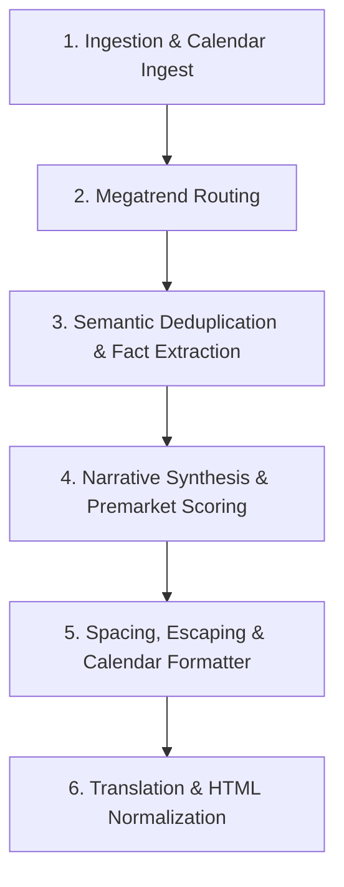

# Alpha Signals Core Pipeline

Alpha Signals Core is an automated, multi-agent Intelligence Pipeline designed to act as a digital Chief Investment Officer (CIO). The system monitors global news feeds, tracks market indicators, extracts actionable financial facts using LLMs, and synthesizes them into highly curated, professionally structured daily reports in English and Korean.

---

## Setup & Dependencies

### 1. System Requirements

- **Ingestion Server**: A remote VM (such as Oracle Cloud) running the Sieve ingestion bot 24/7. Refer to the [sieve repository](https://github.com/as-proiectio/sieve) for details.
- **Orchestration Environment**: A local or server environment (macOS or Linux) to run the pipeline modules.

### 2. Environment Setup

We recommend using [uv](https://github.com/astral-sh/uv) for fast, concurrent dependency management.

```bash
# Clone the repository and sync all dependencies
uv sync
```

Key libraries installed via `pyproject.toml` include `torch`, `sentence-transformers`, `transformers`, `pytz`, `holidays`, `cloudscraper`, `trafilatura`, and `schedule`.

### 3. Configuration (.env)

Copy the example environment file and fill in your keys:

```bash
cp .env.example .env
```

- `GEMINI_API_KEY`: Required. API key for Google AI Studio (used for Gemini model scoring and Gemma translation models).
- `TRANSLATOR_MODEL`: Optional. Comma-separated list of Gemini/Gemma models to use for translation, ordered by preference.
- `OLLAMA_MODEL`: Optional. Local LLM model name for deterministic extraction fallback (defaults to `llama3.1`).
- `ENABLE_GIT_PUSH`: Optional. Set to `true` to automatically publish generated reports to your Git data repository.
- `ORACLE_IP_ADDRESS`: Optional. Remote Oracle Cloud IP hosting Sieve data.
- `ORACLE_SSH_KEY`: Optional. Path to the SSH private key for remote data access.

### 4. Local LLM Setup

Install [Ollama](https://ollama.com/) locally and pull the recommended extraction model:

```bash
ollama pull llama3.1
```

### 5. Running the Pipeline

Run the orchestration loop manually using `uv run`:

```bash
uv run src/__init__.py --type [full|premarket|incremental]
```

### 6. Running Tests

Run the automated test suite using `pytest`:

```bash
uv run pytest tests/
```

### 7. Production Automation (macOS launchd)

To automate daily runs, copy plist configuration files to your LaunchAgents directory and bootstrap them:

```bash
cp scripts/launchd/*.plist ~/Library/LaunchAgents/
launchctl bootstrap gui/$(id -u) ~/Library/LaunchAgents/com.alphasignals.incremental.plist
launchctl bootstrap gui/$(id -u) ~/Library/LaunchAgents/com.alphasignals.full.plist
launchctl bootstrap gui/$(id -u) ~/Library/LaunchAgents/com.alphasignals.premarket.plist
```

---

## Core Features & Data Flow

Alpha Signals Core processes news feeds incrementally to optimize API costs, prevent duplicate extractions, and maintain report formatting standards.



### 1. Ingestion & Calendar Normalization (Sieve)

- **24/7 Feed Gathering**: A remote ingestion agent that gathers RSS, SEC filings, economic calendars, and X posts.
- **NYSE Calendar Alignment**: Integrates NYSE holiday schedules to identify market closures and handle observed weekend shifts.
- **Calendar Merging**: Fetches economic events and earnings calls for target tickers within a rolling 7-day window.
- **Timezone Scheduling**: Groups daily saves by New York timezone (EST) into incremental updates, daily master dumps (06:00 EST), and premarket data (08:30 EST).

### 2. Megatrend Routing (Sorter)

- **Sector Classification**: Routes incoming raw articles into specific investment categories based on GICS classifications and custom keyword definitions.
- **Frequency Matching**: Uses regular expressions to score keyword frequency within article titles and bodies, routing articles to the highest-scoring category or falling back to a general category.

### 3. Fact Extraction & Deduplication (Extractor)

- **Semantic Filtering**: Uses a local Sentence-Transformers model to create article embeddings. Filters out articles with high cosine similarity to previous runs.
- **Incremental States**: Logs processed URLs to prevent redundant LLM analysis across runs.
- **Data Pre-cleaning**: Strips out markdown tables, image captions, and metadata lines to optimize LLM token usage.
- **SEC Direct Bypass**: Fast-tracks SEC filings (8-K, 10-K, 10-Q) directly into the report index as formatted links, bypassing LLM processing costs.
- **Ollama Extraction**: Drives local LLM fact extraction with strict zero-temperature presets to ensure reliable summaries.

### 4. Narrative Synthesis & Premarket Scoring (CIO)

- **Topline KPIs**: Generates a summary list of the most critical market metrics.
- **CIO Commentary**: Drafts a narrative brief that contextualizes macro trends, adhering to a consistent tone and greeting layout.
- **Premarket scoring**: Scores premarket articles across multiple dimensions (Macro Impact, Surprise Catalyst, and Trend Shift) to select the most critical market updates.
- **Floor/Ceiling Rules**: Automatically regulates premarket list sizes to contain between 5 and 12 high-scoring articles.

### 5. Formatting & Markdown Cleanup (Formatter)

- **Weekly Schedule Formatting**: Builds timezone-aligned weekly calendars and maps stock tickers to full company names.
- **Smart Spacing**: Injects HTML line breaks dynamically for list readability, cleans up redundant divider lines, and secures correct spacing below frontmatter headers.
- **LaTeX Protection**: Escapes raw dollar symbols to prevent markdown parser rendering errors.

### 6. Translation & Post-Processing (Translator)

- **API Model Chain**: Translates English reports to Korean using Google AI Studio API with automatic model fallbacks.
- **Translation Caching**: Saves translated blocks to prevent repeating translation API calls.
- **Format Protection**: Replaces CIO greetings on a 1:1 basis and normalizes malformed line breaks (like `<br/ >`) to standard `<br />` tags.

### 7. Orchestration & Publishing (Orchestrator)

- **Single Instance Locks**: Uses a lock file to prevent overlapping runs.
- **Auto-Recovery**: Force-kills hung pipeline tasks and clears stale locks.
- **Git publishing**: Automatically adds, commits, and pushes generated reports to the remote data repository, pulling with rebase beforehand to resolve remote conflicts.

---

## Support Modules

- **`shared/time_utils.py`**: Handles UTC parsing and timezone offsets.
- **`shared/shared_logger.py`**: Color-coded logger outputs.
- **`shared/market_map_targets.json`**: GICS sector mapping files.
- **`src/prompts.py`**: Central repository for Ollama and Gemini prompts.
