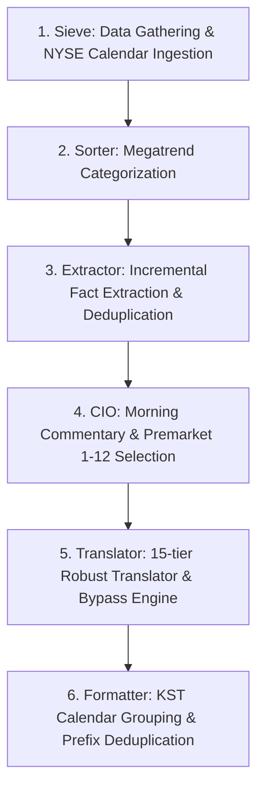

# Buddy Core Pipeline

Buddy Core is an automated, multi-agent Intelligence Pipeline designed to act as a personal multi-billionaire Chief Investment Officer (CIO). The system monitors global news via RSS, tracks market indicators, extracts deeply actionable facts using LLMs, and synthesizes them into highly curated, professionally translated daily reports.

---

## Project Architecture & Data Flow

The pipeline operates on a **Dual-Trigger System** (Full vs. Pre-market) utilizing **incremental processing** to optimize API costs, ensure data continuity, and prevent redundant LLM extraction.



### 1. Sieve (`sieve/`)

**Role:** Data Gathering & Rule-Based Calendar Normalizer

- Deployed on an independent server operating 24/7.
- Continuously gathers raw data from configured RSS feeds, Yahoo Finance, and Finnhub.
- **Unified Economic Calendar Ingestion**: Gathers English and Korean economic calendar occurrences from Investing.com and merges NYSE holiday schedules (using `holidays.financial_holidays("NYSE")`), automatically handling observed days and temporary market closures.
- **Robust API Parameter Binding**: Employs standardized ISO 8601 UTC formats (`%Y-%m-%dT%H:%M:%S.000Z`) with robust query parameter binding (`requests.get(..., params=params)`) to prevent URL decoding mismatches and 400 Bad Request validation failures.
- Normalizes all occurrences into a unified flat list of UTC-time scheduled objects (`weekly_schedule`) in a daily JSON payload (`daily_news_YYYYMMDD.json`).

### 2. Sorter (`src/sorter.py`)

**Role:** Article Categorization

- Segments incoming raw news articles into structural mega-trends (e.g., AI, Crypto, Software, Semiconductor, Aerospace, US Macro) based on GICS sectors and keyword matching.
- Preserves targeted structures to allow agents to process domain-specific sectors efficiently.

### 3. Extractor (`src/extractor.py`)

**Role:** AI Fact Extraction Engine & Incremental State Manager

- Employs a local LLM (Ollama) to parse categorized articles, isolating only hard facts, metrics, and actionable structural insights.
- **Rigorously Deduplicated Filtering**: Applies strict dual URL and title-matching checks to prevent duplicate downstream processing of identical news items and SEC filings.
- **Incremental State Management**: Persists processed entries in `extracted_state_YYYYMMDD.json` to safely bypass previously handled items across consecutive runs, dramatically saving local CPU/GPU resources.

### 4. CIO (`src/cio.py`)

**Role:** Insight Synthesis, Timezone Formatting & Article Selection

- **Full Report (06:00 AM)**: Weaves extracted facts, index indicators, long-term memory, and weekly schedules into a cohesive morning brief ("Daily Point"). Matches the weekly calendar schedule to the local **`America/New_York` (EST/EDT)** timezone for local market relevance.
- **Premarket Report (08:30 AM)**: Selects exactly 5 to 12 of the most critical news items from `extracted_facts`, ranking them strictly by market importance.
- **Strict Format Constraints**: Enforces absolute constraints against generic external links (e.g., Yahoo Finance links) to keep the brief fully self-contained and focused on high-yield signal over noise.

### 5. Translator (`src/translator.py`)

**Role:** localization Engine & Bypass State Machine

- Translates final English briefs into professional, localized Korean.
- **15-Tier Failover Backoff**: Implements an incredibly resilient 15-retry translation fall-back system (`translate_text_with_retry`) across three tiers: Tor Socks5 proxy Google Translate, direct Google Translate, and direct Bing Translate. Uses unicode-based Korean verification to guarantee localization integrity.
- **Schedule Bypass Engine**: To prevent translation artifacts, formatting breaks, and unnecessary API overhead, the translator implements a **Bypass state machine**. When it encounters the `### Weekly Schedule` section header, it skips translating the schedule blocks entirely, passing them raw to the formatter which handles KST localization.

### 6. Formatter (`src/formatter.py`)

**Role:** KST Timezone Grouping, tag Normalization & Prefix Deduplication

- Reconstructs and localizes reports for final publication.
- **KST Calendar Regrouping**: When formatting Korean reports (`lang == "ko"`), it dynamically converts the raw UTC weekly schedule dates into **`Asia/Seoul` (KST)** timezone, groups them by date, and formats them cleanly (e.g. `5월 22일 (금요일)`).
- **Tag Normalization & Line Padding**: Standardizes brackets into clean parentheses tags (e.g. `(미국)`, `(실적)`, `(휴장일)`), injects smart `<br />` breaks, and collapses multiple newline blocks into a single elegant break.
- **Country Prefix Deduplicator**: Automatically detects if a localized event name starts with its country string (e.g., `(미국) 미국 소비자물가지수`) and trims the redundant prefix to produce a clean output (`(미국) 소비자물가지수`). It safely preserves different geographic prefixes (e.g., `(EU) 독일 GDP`) to maintain context.

### Orchestration (`src/__init__.py`)

**Role:** Automated Orchestrator & GitHub Deployment

- Coordinates execution across `incremental`, `full`, and `premarket` triggers.
- Secures Oracle Cloud ingestion, automates file transfers, and handles **Deferred Cleanup** (preserving temporary briefs until the premarket sequence completes).
- Automatically stages, commits, and deploys the finalized localized markdown files (`alpha_signal_*.md`) to the repository.

---

## Utilities & Infrastructure

- **`shared/time_utils.py`**: A unified, centralized time parsing library (`parse_utc_time`) used to parse UTC strings safely across the CIO and Formatter modules, ensuring absolute consistency.
- **`src/prompts.py`**: Highly tuned system prompts for facts extraction, CIO commentary, and premarket importance-ranking.
- **`shared/market_map_targets.json`**: Central target maps representing key stock symbols, sectors, and their professional Korean translations.
- **`memory/`**: Houses long-term semantic context files (`memory_YYYYMMDD.txt`) for narrative continuity.
- **`logs/`**: Segregated, module-specific log output files.
- **`scripts/launchd/`**: Contains macOS `.plist` scheduling configurations to automate local cron execution.

---

## Setup & Dependencies

1. **System Requirements**:
   - Remote ingestion server (Oracle Cloud) running `sieve/sieve.py` 24/7.
   - Local macOS environment running the pipeline via `launchd` tasks.

2. **Python Packages**:
   Install via `pip install -r requirements.txt`.
   Key dependencies: `feedparser`, `yfinance`, `sentence-transformers`, `deep-translator`, `pytz`, `holidays`.

3. **Environment & API Keys**:
   - Ensure a valid `FINNHUB_API_KEY` is configured.
   - Configure Oracle Cloud SSH credentials in `src/__init__.py`.

4. **Local LLM**:
   - Ollama engine must be active locally using the `llama3.1` model.

5. **Automation Configuration via macOS launchd**:
   - Copy the provided `.plist` files from `scripts/launchd/` to `~/Library/LaunchAgents/`.
   - Update the `StartCalendarInterval` blocks in the `.plist` files to match your exact local time for the NY schedule.
   - Load the schedules:
     ```bash
     launchctl load ~/Library/LaunchAgents/com.buddy.incremental.plist
     launchctl load ~/Library/LaunchAgents/com.buddy.full.plist
     launchctl load ~/Library/LaunchAgents/com.buddy.premarket.plist
     ```
   - _Note_: The `.plist` files utilize `/usr/bin/caffeinate -i` to prevent macOS from sleeping during execution.
